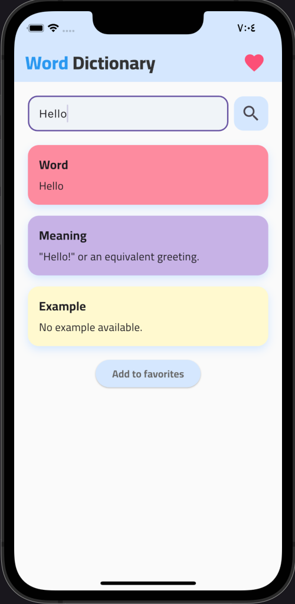
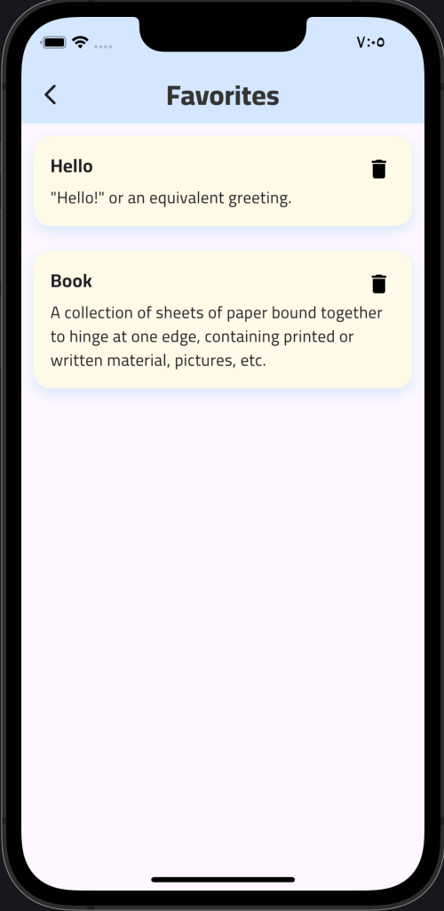

##  Dictionary – Mobile Dictionary App

A cross-platform dictionary app for Android and iOS that provides **instant word definitions, meanings, and example sentences**.  
Features **real-time data fetching** via a public dictionary API, **state management with `flutter_bloc`**, and a **favorites feature** for quick access to saved words.

### Tech Stack
- Flutter
- Dart
- Dio (HTTP client)
- flutter_bloc (State management)

### Screenshots
## Home Screen

## Favorites Screen

---

## License

This project is open source and available under the **MIT License** – see the [LICENSE](LICENSE) file for details.
